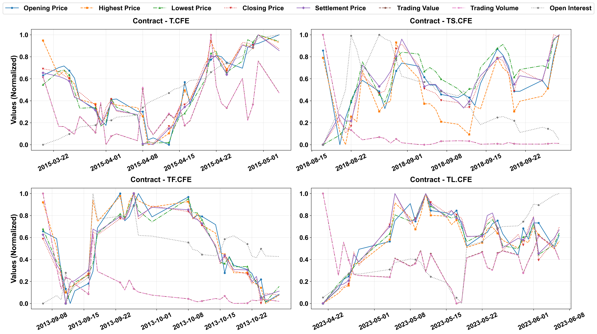

<div align="center">
<h1 style="text-align: center">TF-CoDiT: Conditional Time Series Synthesis with Diffusion Transformers for Treasury Futures</h1>

<p align="center">
  <a href="">Anonymous Authors</a>
</p>

<p align="center">
  
  
  
  

[//]: # (  )
[//]: # (  )
</p>

<div align="center">

</div>
</div>

## Contents

- [Setup](#-setup)
- [Data Preparation](#-data-preparation)
- [Training](#-training)
- [Inference](#-inference)
- [Citation](#-citation)


## Setup

```bash
# Create environment (Python ~3.10)
conda create -n your-project python=3.10
conda activate tf-codit

# Clone repository
git clone https://github.com/username/repo.git  # this well be named once our repo is public
cd repo

# Install dependencies
pip install -r requirements.txt
```


## Data Preparation

Download the data from [Google Drive](https://drive.google.com/file/d/1IKtbx2VHzcos1H5Rk6N_DyVdHjOrOTUB/view?usp=drive_link) and extract the files to `data/`

```bash
python data_process.py \
  --data_dir data \
  --output_dir data/processed
```

## Training

### Train U-VAE
```shell
torchrun \
    --nproc_per_node=4 \
    --nnodes=1 \
    --node_rank=0 \
    --master_addr=localhost \
    --master_port=12355 \
    vae/train_vae.py \
    --config_file configs/vae/ts-vae.yaml
```

### Train DiT
```shell
deepspeed train.py -c configs/dit/gemma-it.yaml
````

Configs live in `configs/`. Adjust batch size, model paths, etc. as needed.


## Inference

**1. Convert checkpoint to diffusers pipeline:**

```bash
python sample.py \
    --fusedit_config configs/fusedit/config.yaml \
    --fusedit_checkpoint outputs/fusedit \
    --vae_checkpoint outputs/vae_for_dwt_d64 \
    --prompt "generate TF contract from 2025-01-01 to 2025-02-01" \
    --num_inference_steps 50 \
    --guidance_scale 7.0 \
    --output_dir ./results
```

[//]: # ()
[//]: # (## Evaluation)

[//]: # ()
[//]: # (| Benchmark | Command |)

[//]: # (|--||)

[//]: # (| **GenEval** | `accelerate launch evaluation/sample_geneval.py evaluation/geneval.yaml` |)

[//]: # (| **DPG-Bench** | `accelerate launch evaluation/sample_dpgbench.py evaluation/dpgbench.yaml` |)

[//]: # (| **FID &#40;MJHQ-30K&#41;** | `accelerate launch evaluation/sample_mjhq.py ...` + `python evaluation/fid.py ...` |)

[//]: # ()
[//]: # (See each benchmark’s official repo and scripts in `evaluation/` for full steps.)
[//]: # ()
[//]: # ()

## Citation

```bibtex
@article{author2026tf-codit,
  title  = {TF-CoDiT: Conditional Time Series Synthesis with Diffusion Transformers for Treasury Futures},
  author = {Anonymous Authors},
  year   = {2026},
  journal = {arXiv preprint arXiv:2601.xxxxx}
}
```